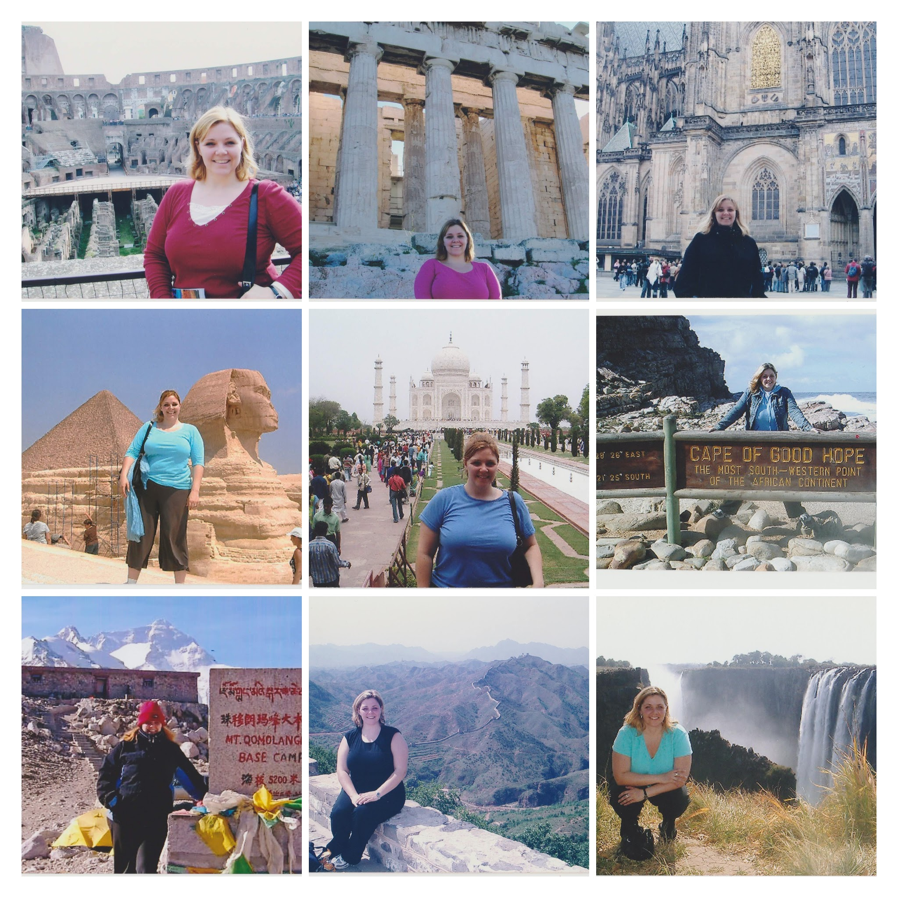
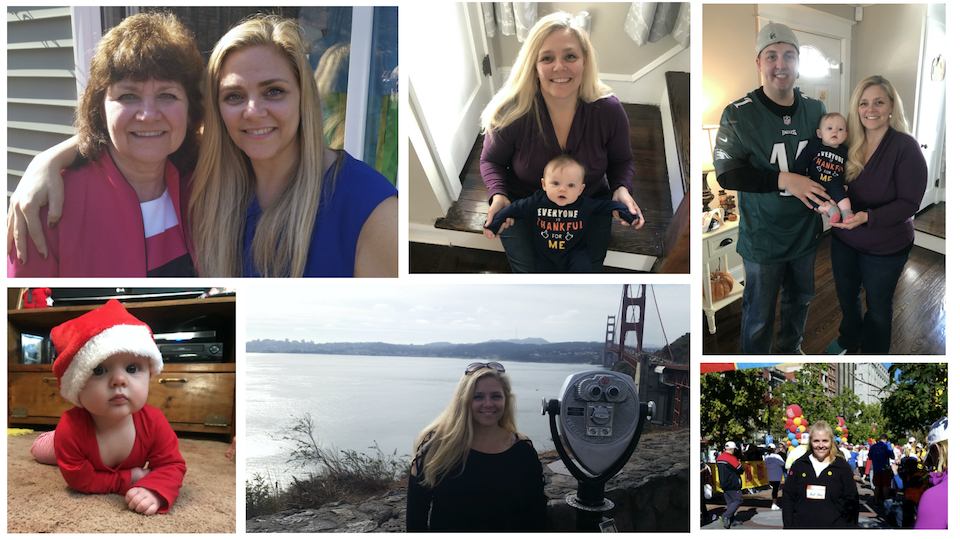

I have loved books my entire life. I still remember reading with my mom each day, my brother and me snuggled on each side of her in one big chair, listening to her bring books to life in our imaginations for hours on end. My mom instilled in me a love for reading and sharing stories together. Becoming a mom has brought a new level of love and appreciation for how a wonderful story can be shared with our little ones. 

My first book is Again and Again. I began writing fun little stories to entertain my son, which then grew to include drawing pictures of bunnies (a favorite in our house!) and finally to a full book inspired by a favorite phrase “Again!”. I hope it brings smiles and laughter of recognition to your family the way that it has to mine.

**Fun facts**:
- I have traveled to 96 foreign countries! Is it any wonder that I loves maps and globes? (I even collect them!)

- I have been to 31 states in the USA, but have only lived in three. My family is planning a cross-country trip in the coming years to see all of the continental United States, and hope to one day visit Hawaii.

- I am a certified scuba diver and have been diving in Belize, Australia, the Maldives and Seychelles. Underwater worlds of colorful fish and aquatic life fascinate me!

- I speak Spanish, and plan to one day write a book in Spanish, too! I plan to learn how to cook arroz con leche, because my son learned about it from a book!

- Becoming a mom has been the biggest accomplishment and joy of my life.

